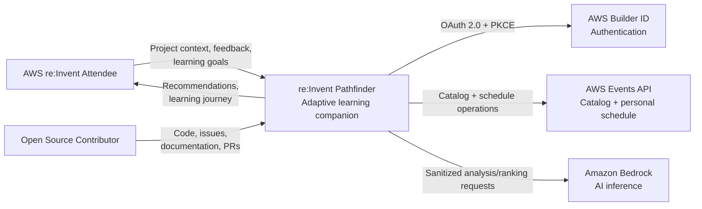
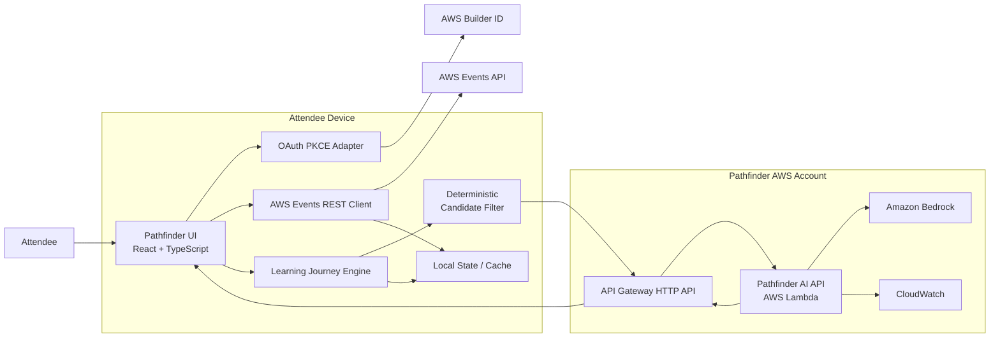
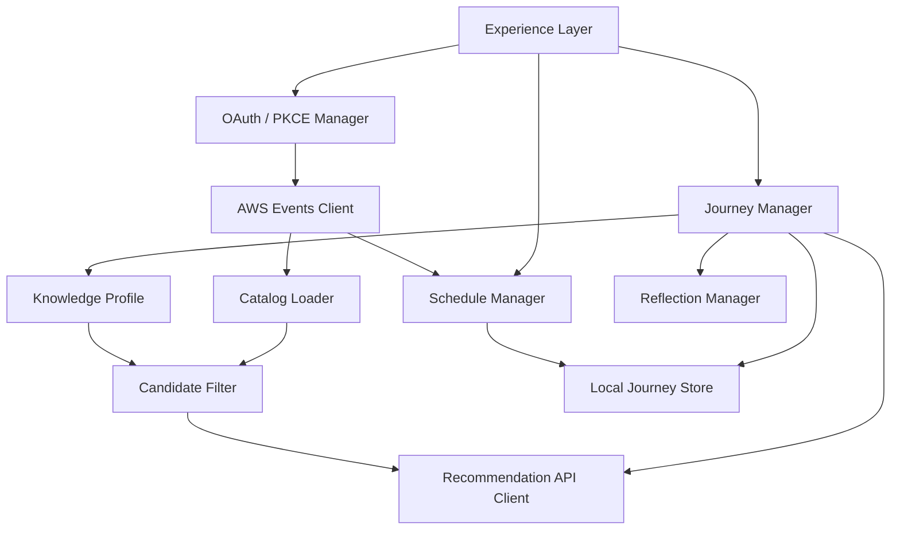
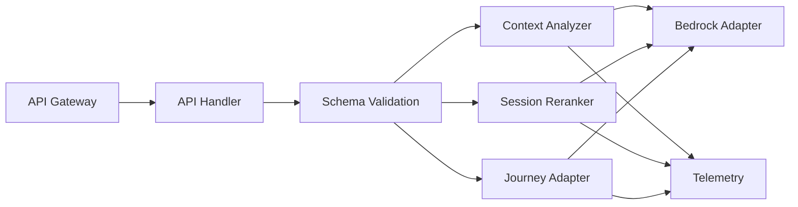
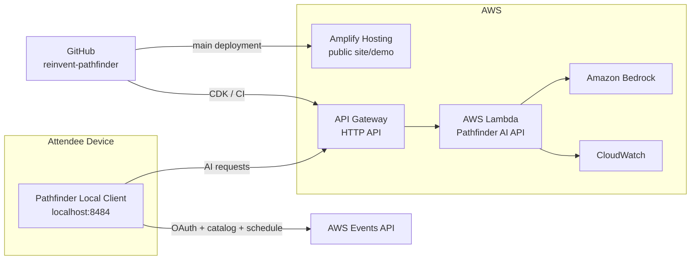

# re:Invent Pathfinder — Technical Project Brief

> **Status:** Draft / Living document  
> **Project:** re:Invent Pathfinder  
> **Hackathon:** re:Invent Event Catalog API Hackathon  
> **Repository:** https://github.com/Trycatch-tv/reinvent-pathfinder  
> **Builder Center:** https://builder.aws.com/build/hackathons/7c0e8c59-35d9-3ceb-8f80-0d5dc41bfebf/reinvent-event-catalog-api-hackathon?tab=projects  
> **Development model:** Open source + community + Knowledge-Driven Development (KDD)  
> **Primary language proposed:** TypeScript  
> **Last reviewed:** September 2026

---

## 1. Why this document exists

This document gives contributors enough context to understand **what re:Invent Pathfinder is, how it should work, the technical constraints that shape it, the proposed architecture, the AWS resources involved, and how the project will be built and deployed**.

It is intentionally a **living technical brief**, not a frozen specification.

Architecture can change as we learn from:

- the AWS Events API;
- real attendee behavior;
- hackathon feedback;
- community contributions;
- implementation constraints;
- cost and performance measurements.

Significant architectural changes should be captured as ADRs instead of silently changing the implementation.

---

## 2. Product summary

**re:Invent Pathfinder** is an AI-powered companion that transforms the AWS re:Invent catalog into an **adaptive learning journey**.

Instead of recommending sessions only from roles, interests, or keywords, Pathfinder starts with a different question:

> **What are you building?**

The attendee describes a project, technical challenge, architecture, or learning objective. Pathfinder uses that context to identify relevant knowledge needs and gaps, maps them against the re:Invent session catalog, and recommends sessions that can help move the attendee's work forward.

The journey evolves during the event.

```text
What are you building?
        ↓
Knowledge needs
        ↓
Knowledge gaps
        ↓
Relevant sessions
        ↓
Personal learning path
        ↓
Attend + reflect
        ↓
Update knowledge gaps
        ↓
Adapt recommendations
```

The goal is to move from:

> “What sessions look interesting?”

to:

> **“What should I learn at re:Invent based on what I am actually building?”**

---

## 3. Product principles

### 3.1 Learning before scheduling
Pathfinder is not primarily a calendar optimizer. Its first objective is to maximize **learning relevance**. Scheduling and event logistics support that objective.

### 3.2 Context before keywords
The primary signal is the attendee's real project or technical challenge.

### 3.3 Adaptive rather than static
Recommendations should evolve as the attendee learns.

### 3.4 Human in the loop
Pathfinder recommends and explains. The attendee decides what to favorite, reserve, remove, attend, or skip.

### 3.5 Explainable recommendations
Every recommendation should answer:
- Why is this relevant?
- Which knowledge gap does it address?
- What does the attendee gain by attending?
- What trade-off exists if the session conflicts with another option?

### 3.6 Open source and community driven
Architecture, issues, implementation, trade-offs, experiments, and learning are developed in public with the TryCatch.tv community.

### 3.7 Cost-aware AI
AI should be used where semantic understanding adds value. Do not send the entire re:Invent catalog to an LLM every time.

### 3.8 Knowledge-Driven Development
Product, business, technical, architectural, and delivery knowledge should remain explicit and evolve with the code through Kaddo.

---

## 4. Core user journey

```text
1. Start Pathfinder
        ↓
2. Sign in with AWS Builder ID
        ↓
3. Describe project / challenge
        ↓
4. Analyze required knowledge
        ↓
5. Load re:Invent catalog
        ↓
6. Deterministically reduce candidates
        ↓
7. AI ranks and explains candidates
        ↓
8. Build initial learning path
        ↓
9. Favorite / reserve sessions
        ↓
10. Attend session
        ↓
11. Capture quick reflection
        ↓
12. Update knowledge gaps
        ↓
13. Recalculate the next best sessions
```

---

## 5. Critical AWS Events API constraint

AWS Events API authentication uses OAuth 2.0 Authorization Code + PKCE with AWS Builder ID and a loopback callback running on the attendee's machine.

Custom applications must listen at `/callback` on one of these reserved ports:

```text
http://localhost:8484/callback
http://localhost:8485/callback
http://localhost:8486/callback
http://localhost:8487/callback
http://localhost:8488/callback
http://localhost:8489/callback
```

There is **no hosted redirect URI for a custom application**.

### Architectural consequence
Pathfinder should be treated as a **local-first application with cloud AI services**.

```text
Attendee device
     │
     ├── AWS Events authentication
     ├── AWS Events tokens
     ├── event catalog
     ├── attendee schedule
     └── learning journey
             │
             │ sanitized AI requests
             ▼
        Pathfinder AWS backend
             │
             ▼
        Amazon Bedrock
```

A public hosted experience can still exist for the landing page, project explanation, a demo with sample/sanitized data, architecture and documentation. Authenticated AWS Events operations must originate from the attendee's local application.

---

## 6. Security boundary

AWS requires that an AWS Events **access token only be sent to `https://api.awsevents.com`**.

Pathfinder must never forward the AWS Events access token to:

- Pathfinder's backend;
- Amazon Bedrock;
- analytics;
- logging systems;
- third-party services.

For a browser-based local application, access and refresh tokens should remain **in memory only**.

Do not store them in:

```text
localStorage
IndexedDB
cookies
application logs
DynamoDB
CloudWatch
analytics payloads
```

After a browser reload, reauthorization is preferable to persisting event tokens.

### Trust zones

```text
┌────────────────────────────────────────────┐
│ TRUST ZONE A — Attendee device             │
│                                            │
│ AWS Events OAuth tokens                    │
│ AWS Events API client                      │
│ Local journey data                         │
│ Catalog cache                              │
└────────────────┬───────────────────────────┘
                 │
                 │ sanitized context only
                 ▼
┌────────────────────────────────────────────┐
│ TRUST ZONE B — Pathfinder AWS backend      │
│                                            │
│ API Gateway                                │
│ Lambda                                     │
│ Bedrock                                    │
│ CloudWatch                                 │
└────────────────────────────────────────────┘
```

---

## 7. AWS Events API

### Base endpoint

```text
https://api.awsevents.com
```

All REST paths start with `/v1`.

The official OpenAPI contract is available at:

```text
https://api.awsevents.com/v1/openapi.json
```

### Operations relevant to Pathfinder

**Event discovery**
```text
ListEvents
GetEvent
```

**Catalog**
```text
ListSessions
GetSession
```

**Personal schedule**
```text
GetSchedule
ReserveSessions
CancelReservation
AssociateFavorites
DisassociateFavorite
CreatePersonalTime
UpdatePersonalTime
DeletePersonalTime
```

AWS Events API does **not provide catalog search or filtering**. Pathfinder must retrieve sessions and implement its own filtering, relevance scoring, semantic matching, and ranking.

---

## 8. Session catalog behavior

`ListSessions` is paginated. The implementation must continue until `nextToken` is absent. Never stop because a page contains fewer results than expected.

When abstracts are not required during an early filtering phase, use:

```text
includeAbstracts=false
```

A session may include title, abstract, session code, type, level, tracks, topics, industries, roles, AWS services, start/end, room, venue, speakers, reservability, and coarse availability information.

Any individual field may be absent, so parsing must be defensive.

---

## 9. Schedule behavior

`GetSchedule` returns reservations, favorites, and personal time. Pathfinder should treat it as the **source of truth** for attendee schedule data.

After any write operation, read `GetSchedule` again.

```text
Reserve 3 sessions
       ↓
2 succeed
1 fails
       ↓
Do not assume request-level success
       ↓
GetSchedule
       ↓
Render actual state
```

---

## 10. API quotas and resilience

Relevant current quotas include:

| Operation | Quota / minute |
|---|---:|
| GetSession | 120 |
| ListSessions | 60 |
| GetSchedule | 60 |
| ReserveSessions | 30 sessions |
| CancelReservation | 30 |
| AssociateFavorites | 30 sessions |
| DisassociateFavorite | 30 |
| CreatePersonalTime | 30 |
| UpdatePersonalTime | 30 |
| DeletePersonalTime | 30 |

When throttled, the API returns `429` with a `Retry-After` header. The client must honor it.

### Error strategy

```text
400 → request error; do not blindly retry
401 → refresh/re-authenticate, then retry once
403 → authenticated but not registered for event
409 → operation temporarily unavailable / closed
429 → wait Retry-After
5xx → bounded exponential backoff
```

---

## 11. Reservation availability

For re:Invent 2026:

```text
Reserved seating opens normally: October 6, 2026
AWS Events API reservations:     October 8, 2026
```

Before API reservation operations open, reserve/cancel calls return `409`. Catalog reads and favorites can still be used.

---

## 12. Proposed technology stack

This stack is a **starting proposal**, not a permanent constraint.

| Layer | Proposed technology | Purpose |
|---|---|---|
| Language | TypeScript | Shared application/IaC language |
| Local client | React + Vite | Fast lightweight client |
| Local launcher | Node.js | Local HTTP server + OAuth callback |
| Package manager | pnpm | Monorepo/workspace |
| AWS Events | REST API | Runtime integration |
| AI development | AWS Events MCP + Kiro | Exploration and agent tooling |
| AI inference | Amazon Bedrock | Knowledge analysis and reranking |
| AI API | Bedrock Converse API | Model-independent interface |
| Backend | AWS Lambda | Stateless AI orchestration |
| API | API Gateway HTTP API | Public backend boundary |
| Public site | AWS Amplify Hosting | Landing/demo/documentation |
| Observability | Amazon CloudWatch | Logs, metrics, alarms |
| Infrastructure | AWS CDK + TypeScript | Infrastructure as Code |
| Tests | Vitest + MSW + Playwright | Unit/integration/E2E |
| Development agent | Kiro | AI-assisted implementation |
| Knowledge layer | Kaddo | KDD and project knowledge |
| Source control | GitHub | Open-source collaboration |

---

## 13. Why REST at runtime and MCP during development?

AWS exposes the same event capabilities through REST and MCP.

### Runtime
Use **AWS Events REST API** so Pathfinder controls pagination, caching, UI state, error handling, schedule state, and deterministic filtering.

### Development / experimentation
Use the official **AWS Events MCP** with Kiro:

```text
https://api.awsevents.com/mcp
```

MCP is useful for exploring the API, manually testing event operations, understanding catalog data, and letting Kiro interact with AWS Events during development.

---

## 14. Distribution model

An initial contributor/developer experience can be:

```bash
git clone https://github.com/Trycatch-tv/reinvent-pathfinder
pnpm install
pnpm dev
```

The application can run at:

```text
http://localhost:8484
```

and handle:

```text
http://localhost:8484/callback
```

A later distribution may package the application behind `npx reinvent-pathfinder` or a desktop app if that adds enough user value. Desktop packaging is **not required for the initial MVP**.

---

## 15. High-level architecture

```text
                    ATTENDEE DEVICE

             ┌──────────────────────────┐
             │ Pathfinder Local Client  │
             │ React + TypeScript       │
             │                          │
             │ Project context          │
             │ Knowledge gaps           │
             │ Event catalog cache      │
             │ Schedule                 │
             │ OAuth tokens (memory)    │
             └──────────┬───────┬───────┘
                        │       │
             OAuth/REST │       │ HTTPS
                        │       │ sanitized context
                        ▼       ▼
            ┌───────────────┐  ┌──────────────────────┐
            │ AWS Events API│  │ API Gateway          │
            │ + Builder ID  │  │        ↓             │
            └───────────────┘  │ Lambda               │
                               │        ↓             │
                               │ Amazon Bedrock       │
                               │        ↓             │
                               │ CloudWatch           │
                               └──────────────────────┘
                                        AWS CLOUD
```

---

## 16. C4 — Level 1: System Context



---

## 17. C4 — Level 2: Containers



### Container responsibilities

**Local Pathfinder Client** owns AWS Events authentication, tokens, catalog retrieval, pagination, normalization, local caching, current schedule, knowledge journey state, deterministic filtering, attendee reflections, and user interaction.

**Pathfinder AI API** owns request validation, prompt orchestration, model invocation, structured AI responses, AI telemetry, and cost attribution. For the MVP it should remain mostly stateless.

**AWS Events API** remains the source of truth for event/session information and attendee schedule operations.

---

## 18. C4 — Level 3: Local client components



---

## 19. C4 — Level 3: AI backend components



---

## 20. AI architecture

Pathfinder should **not ask an LLM to search the entire catalog**.

```text
Project context
      ↓
AI extracts structured knowledge needs
      ↓
AWS Events catalog
      ↓
Deterministic metadata filtering
      ↓
Small candidate set
      ↓
Amazon Bedrock semantic reranking
      ↓
Explain recommendations
      ↓
Learning path
```

This improves cost, latency, reproducibility, explainability, and token usage.

---

## 21. AI responsibilities

### Context analysis

Input:

```text
I'm building an agentic developer tool using MCP,
event-driven architecture, AWS and observability.
```

Output:

```json
{
  "domains": [
    "agentic systems",
    "developer tooling",
    "event-driven architecture",
    "observability"
  ],
  "knowledgeGaps": [
    {
      "topic": "agent observability",
      "priority": "high",
      "reason": "The project requires tracing and observability for agent workflows."
    }
  ]
}
```

### Session reranking
Input: knowledge profile + candidate sessions + current schedule + preferences.

Output: relevance score + knowledge gaps covered + explanation + trade-offs.

### Adaptive learning
After a session, ask what was learned, what remains unclear, and how useful the session was. Pathfinder updates the knowledge profile and reruns recommendations.

---

## 22. Recommendation pipeline

A proposed scoring model:

```text
Knowledge-gap coverage        35%
Semantic project relevance    30%
Novel knowledge               15%
Schedule compatibility        10%
Session level / format         5%
Logistics / venue              5%
```

These numbers are hypotheses and should be validated during the hackathon.

A recommendation should explain **why** it exists rather than expose only a score.

---

## 23. Amazon Bedrock

Use **Bedrock Converse API** where possible. It provides a common interface across models that support messages and reduces coupling to one model.

Suggested configuration:

```text
BEDROCK_REGION
BEDROCK_MODEL_ID
BEDROCK_INFERENCE_PROFILE_ARN
```

Suggested abstraction:

```ts
interface AIProvider {
  analyzeContext(input: AnalyzeContextInput): Promise<KnowledgeProfile>;
  rankSessions(input: RankSessionsInput): Promise<RankedSession[]>;
  adaptJourney(input: AdaptJourneyInput): Promise<KnowledgeProfile>;
}
```

Use an **Application Inference Profile** when supported to attribute Pathfinder usage and cost.

---

## 24. Suggested backend API

```text
GET  /health
POST /v1/context/analyze
POST /v1/recommendations/rank
POST /v1/journey/adapt
```

Example:

```http
POST /v1/context/analyze
```

```json
{
  "projectContext": "We are building...",
  "learningObjective": "Understand..."
}
```

Response:

```json
{
  "technologies": [],
  "awsServices": [],
  "architectureConcerns": [],
  "knowledgeGaps": [
    {
      "id": "kg-001",
      "topic": "agent observability",
      "priority": "high",
      "confidence": 0.91,
      "reason": "..."
    }
  ]
}
```

Use JSON schemas for all AI-facing contracts. Never trust free-form model output directly.

---

## 25. Backend access protection

The AI backend creates a potential cost-abuse surface because it invokes Bedrock.

For the hackathon MVP:

- strict API Gateway/Lambda throttling;
- small request-size limits;
- maximum candidate-session limits;
- per-request inference limits;
- AWS Budget alarms;
- CloudWatch alarms;
- optional lightweight per-client/IP rate controls.

A dedicated authentication strategy for Pathfinder's own backend should be treated as an **architecture spike**.

> Never solve backend authentication by forwarding the AWS Events access token.

---

## 26. Local state

### Memory only

```text
AWS Events access token
AWS Events refresh token
PKCE verifier
OAuth state
authorization code
```

### Local persistence

Non-sensitive Pathfinder state may be stored locally:

```text
project context
learning objective
knowledge profile
knowledge-gap status
reflection history
recommendation history
cached session metadata
UI preferences
```

IndexedDB is sufficient if structured local persistence becomes necessary. A central database is not required for the first MVP.

---

## 27. Core domain model

```text
AttendeeJourney
│
├── projectContext
├── learningObjective
├── knowledgeProfile
│   └── knowledgeGaps[]
│
├── candidateSessions[]
├── recommendations[]
├── eventSchedule
└── reflections[]
```

```ts
type KnowledgeGap = {
  id: string;
  topic: string;
  priority: "low" | "medium" | "high";
  confidence: number;
  status: "open" | "in-progress" | "covered";
  reason: string;
};

type SessionRecommendation = {
  sessionId: string;
  score: number;
  gapsCovered: string[];
  reason: string;
  tradeoffs?: string[];
};

type Reflection = {
  sessionId: string;
  learned?: string;
  stillUnclear?: string;
  usefulness?: 1 | 2 | 3 | 4 | 5;
  createdAt: string;
};
```

---

## 28. AWS infrastructure

Minimum proposed resources:

```text
AWS Amplify Hosting
Amazon API Gateway HTTP API
AWS Lambda
Amazon Bedrock
Amazon CloudWatch
AWS IAM
AWS Budgets
```

Potential later resources:

```text
Amazon DynamoDB
Amazon S3
Amazon Cognito
AWS WAF
Route 53
```

Only add them when a requirement appears.

The MVP does **not** require EC2, ECS, EKS, RDS, OpenSearch, Bedrock Knowledge Bases, SageMaker, ElastiCache, or a vector database.

---

## 29. Deployment topology



---

## 30. Public hosted experience

Amplify Hosting can expose:

- product explanation;
- architecture;
- open-source contribution entry points;
- demo using sample/sanitized session data;
- instructions to launch the local authenticated client;
- link to GitHub;
- link to Builder Center.

The hosted experience should not claim that it can perform authenticated AWS Events schedule operations unless AWS later adds a supported hosted OAuth redirect mechanism.

---

## 31. Infrastructure as Code

Use **AWS CDK v2 with TypeScript**.

Suggested structure:

```text
infra/
└── cdk/
    ├── bin/
    │   └── pathfinder.ts
    ├── lib/
    │   ├── api-stack.ts
    │   ├── observability-stack.ts
    │   └── hosting-stack.ts
    └── cdk.json
```

Prefer the smallest infrastructure that remains understandable.

---

## 32. Proposed repository structure

```text
reinvent-pathfinder/
│
├── apps/
│   ├── pathfinder/           # local-first React application
│   └── site/                 # public landing/demo
│
├── services/
│   └── api/                  # Lambda handlers
│
├── packages/
│   ├── domain/               # learning journey domain
│   ├── events-client/        # AWS Events REST adapter
│   ├── ai-contracts/         # DTO / schemas
│   └── shared/               # truly shared utilities
│
├── infra/
│   └── cdk/
│
├── docs/
│   ├── architecture/
│   ├── adr/
│   └── technical-brief.md
│
├── knowledge/                # Kaddo knowledge repository
├── .kaddo/
│
├── .github/
│   ├── workflows/
│   ├── ISSUE_TEMPLATE/
│   └── PULL_REQUEST_TEMPLATE.md
│
├── CONTRIBUTING.md
├── CODE_OF_CONDUCT.md
├── SECURITY.md
├── LICENSE
└── README.md
```

Do not create packages just to make the repository look architectural. Split only when real boundaries emerge.

---

## 33. Knowledge-Driven Development with Kaddo

Pathfinder will be built using Kaddo as the project's knowledge layer.

```text
Business
   ↓
Product
   ↓
Tech
   ↓
Delivery
```

Development loop:

```text
Knowledge
   ↓
Context
   ↓
Architecture
   ↓
Decisions
   ↓
Roadmap
   ↓
Work Items
   ↓
Code
   ↓
Learning
   ↓
Updated knowledge
```

Possible bootstrap:

```bash
npx @kaddo/cli init
kaddo bootstrap
kaddo context
kaddo add agents
kaddo understand
```

Kaddo supports the development process; it should not become a runtime dependency of Pathfinder unless a concrete product requirement later justifies that.

---

## 34. Development with Kiro

Kiro is used as an AI development environment.

The official AWS Events MCP server is:

```text
https://api.awsevents.com/mcp
```

Official Kiro configuration:

```json
{
  "mcpServers": {
    "awsevents": {
      "url": "https://api.awsevents.com/mcp",
      "oauth": {
        "clientId": "7vmom55m1qstvq8i71ph127bfq",
        "redirectUri": "http://127.0.0.1:8976",
        "oauthScopes": [
          "openid",
          "email",
          "events/access"
        ]
      }
    }
  }
}
```

This enables Kiro to explore AWS Events through MCP during development.

---

## 35. Testing strategy

There is currently no dedicated AWS Events API sandbox documented in the public developer guide.

### Automated
Mock AWS Events behavior for:

```text
OAuth callback
pagination
missing optional fields
401
403
409
429 + Retry-After
partial favorite results
partial reservation results
expired tokens
Bedrock failures
invalid model JSON
```

Suggested tools:

```text
Vitest
MSW
Playwright
```

### Real integration
Use the real AWS Events API for selected tests with a real AWS Builder ID, an attendee registered for re:Invent, and an allowed loopback callback port.

Never commit real tokens or attendee data to fixtures.

---

## 36. Observability

### Backend technical metrics

```text
request count
latency
4xx
5xx
Bedrock invocation errors
Bedrock latency
input tokens
output tokens
```

### Product metrics
Potential non-sensitive metrics:

```text
learning paths generated
recommendations generated
session recommendations accepted
reflections captured
journeys recalculated
```

Do not log OAuth credentials or full project context by default.

---

## 37. Cost controls

Use:

- deterministic filtering before AI;
- candidate limits;
- output-token limits;
- configurable Bedrock model;
- application inference profiles when supported;
- cost-allocation tags;
- AWS Budget alerts.

Suggested budget guardrail pattern:

```text
50% warning
80% warning
100% alert
```

The actual budget value should be configured by the project owner.

---

## 38. CI/CD

Suggested GitHub Actions pipeline:

```text
Pull Request
    ↓
install
    ↓
lint
    ↓
typecheck
    ↓
unit tests
    ↓
integration tests
    ↓
build
    ↓
cdk synth
```

For `main`:

```text
merge
  ↓
tests
  ↓
build
  ↓
deploy backend
  ↓
deploy public site
  ↓
smoke test
```

Amplify can provide preview deployments for pull requests for the public web application.

---

## 39. Contribution workflow

```text
Idea / feedback
      ↓
GitHub Issue or Kaddo Work Item
      ↓
Clarify expected outcome
      ↓
Branch
      ↓
Implementation
      ↓
Tests
      ↓
Pull Request
      ↓
Community / maintainer review
      ↓
Merge
      ↓
Update project knowledge when necessary
```

Good first contributions should be deliberately small and independently testable.

Examples:

- OAuth PKCE helper tests;
- AWS Events type definitions;
- session pagination;
- session normalization;
- error normalization;
- deterministic session filters;
- accessibility improvements;
- documentation;
- test fixtures;
- UI components.

---

## 40. Definition of Done for an MVP feature

```text
[ ] Acceptance criteria satisfied
[ ] Unit/integration tests added
[ ] Errors handled
[ ] No tokens logged
[ ] Accessibility considered
[ ] Cost impact considered for AI calls
[ ] Documentation updated when needed
[ ] Relevant Kaddo knowledge updated
[ ] PR reviewed
```

---

## 41. Initial architecture decisions to capture as ADRs

### ADR-001 — Local-first authenticated experience
**Reason:** AWS Events OAuth only supports registered loopback callbacks for custom applications.

### ADR-002 — REST API for Pathfinder runtime
**Reason:** Pathfinder needs controlled filtering, caching, errors, state, and UX. MCP remains important for Kiro/development and experiments.

### ADR-003 — Cloud AI backend with Amazon Bedrock
**Reason:** centralizes prompts, model configuration, telemetry, cost controls, and credentials.

### ADR-004 — Deterministic pre-filter before AI reranking
**Reason:** reduces cost, latency, and non-determinism.

### ADR-005 — No central database in the first MVP
**Reason:** learning state can initially remain local; avoid unnecessary infrastructure and personal-data handling.

### ADR-006 — TypeScript end to end
**Reason:** shared types, Node runtime, React, CDK, contributor familiarity, and Kiro support.

Each ADR should still document alternatives and trade-offs before being treated as final.

---

## 42. Important open questions

### Product
- How much project context should the attendee provide?
- What is the minimum useful reflection after a session?
- Should a user be able to manually edit the knowledge-gap profile?
- How should Pathfinder explain uncertainty?

### AI
- Which Bedrock model gives the best quality/cost balance?
- How many candidates should reach semantic reranking?
- Should semantic embeddings be introduced later, or is reranking enough?
- How should recommendation quality be measured?

### Authentication
- How should Pathfinder protect its own Bedrock-backed API without adding unnecessary login friction?
- Can the AWS Events ID token safely support Pathfinder application identity after a validation spike, or should another approach be used?

### Distribution
- Is an `npx` launcher sufficient for the hackathon?
- Would Tauri/Electron materially improve the attendee experience?

### Logistics
- Does available venue/session information provide enough data for useful travel-time scoring?
- Do we need a separate map/distance source?

---

## 43. MVP delivery slices

### VS-001 — Project foundation
```text
TypeScript workspace
React local client
Lambda API
CDK
CI
basic observability
```

### VS-002 — AWS Events authentication and catalog
```text
PKCE
Builder ID sign-in
session pagination
catalog normalization
token lifecycle
```

### VS-003 — Project context → knowledge gaps
```text
project input
Bedrock analysis
structured profile
editable gaps
```

### VS-004 — Knowledge gaps → session recommendations
```text
deterministic candidate filter
Bedrock reranking
explanations
learning path
```

### VS-005 — Personal schedule integration
```text
GetSchedule
favorites
conflict awareness
schedule refresh
```

### VS-006 — Adaptive learning journey
```text
session reflection
gap update
recommendation recalculation
before/after visualization
```

### VS-007 — Reservations
```text
reserve
cancel
partial-result handling
GetSchedule reconciliation
```

### VS-008 — Public demo and hackathon submission
```text
Amplify site
architecture
screenshots
demo
documentation
Builder Center update
```

---

## 44. Documentation resources

### AWS Events API

- Developer Guide: https://docs.aws.amazon.com/events/latest/devguide/what-is-events-api.html
- Getting started: https://docs.aws.amazon.com/events/latest/devguide/getting-started.html
- REST API: https://docs.aws.amazon.com/events/latest/devguide/rest-api.html
- OpenAPI: https://api.awsevents.com/v1/openapi.json
- Authentication: https://docs.aws.amazon.com/events/latest/devguide/authentication.html
- OAuth endpoints and values: https://docs.aws.amazon.com/events/latest/devguide/auth-endpoints.html
- Signing an attendee in: https://docs.aws.amazon.com/events/latest/devguide/auth-signing-in.html
- Token security: https://docs.aws.amazon.com/events/latest/devguide/auth-handling-tokens.html
- ListSessions: https://docs.aws.amazon.com/events/latest/devguide/rest-op-listsessions.html
- GetSchedule: https://docs.aws.amazon.com/events/latest/devguide/rest-op-getschedule.html
- Quotas and throttling: https://docs.aws.amazon.com/events/latest/devguide/quotas.html
- Errors: https://docs.aws.amazon.com/events/latest/devguide/errors.html
- AWS Events MCP server: https://docs.aws.amazon.com/events/latest/devguide/mcp-server.html

### Amazon Bedrock

- Documentation: https://docs.aws.amazon.com/bedrock/
- Converse API: https://docs.aws.amazon.com/bedrock/latest/userguide/conversation-inference.html
- Inference: https://docs.aws.amazon.com/bedrock/latest/userguide/inference.html
- Inference profiles: https://docs.aws.amazon.com/bedrock/latest/userguide/inference-profiles.html
- Application inference profiles: https://docs.aws.amazon.com/bedrock/latest/userguide/cost-mgmt-application-inference-profiles.html
- Pricing: https://aws.amazon.com/bedrock/pricing/

### AWS deployment

- API Gateway HTTP APIs: https://docs.aws.amazon.com/apigateway/latest/developerguide/http-api.html
- AWS Lambda: https://docs.aws.amazon.com/lambda/latest/dg/welcome.html
- AWS Amplify Hosting: https://docs.aws.amazon.com/amplify/latest/userguide/welcome.html
- Amplify + GitHub: https://docs.aws.amazon.com/amplify/latest/userguide/setting-up-GitHub-access.html
- AWS CDK with TypeScript: https://docs.aws.amazon.com/cdk/v2/guide/work-with-cdk-typescript.html
- Amazon CloudWatch: https://docs.aws.amazon.com/cloudwatch/
- AWS Budgets: https://docs.aws.amazon.com/cost-management/latest/userguide/budgets-managing-costs.html

### Kiro

- Documentation: https://kiro.dev/docs/
- MCP: https://kiro.dev/docs/mcp/
- Powers: https://kiro.dev/docs/powers/

### Kaddo / Knowledge-Driven Development

- Kaddo: https://kaddo.trycatch.tv/
- Getting started: https://kaddo.trycatch.tv/getting-started/
- Manifesto / KDD: https://kaddo.trycatch.tv/manifesto/
- Full workflow: https://kaddo.trycatch.tv/use-cases/full-workflow/
- New project workflow: https://kaddo.trycatch.tv/use-cases/new-project/
- Visual guide: https://kaddo.trycatch.tv/visual-guide/

---

## 45. Quick start for a new contributor

```text
1. Read this Technical Brief
2. Read README / CONTRIBUTING
3. Review the current Kaddo Work Item
4. Review relevant ADRs
5. Read the official AWS documentation linked above
6. Pick or discuss a GitHub issue
7. Implement the smallest useful slice
8. Add tests
9. Open a Pull Request
10. Document what we learned
```

---

## 46. One-sentence architecture summary

> **re:Invent Pathfinder is a local-first TypeScript application that talks directly to AWS Events API for attendee-specific event data and uses a small AWS serverless backend with Amazon Bedrock to transform project context and knowledge gaps into an adaptive re:Invent learning journey.**

---

## 47. Success criteria

The MVP is successful when an attendee can:

```text
describe what they are building
        ↓
authenticate with AWS Builder ID
        ↓
load the real re:Invent catalog
        ↓
receive explainable recommendations
based on knowledge gaps
        ↓
build/use their schedule
        ↓
reflect after a session
        ↓
see the learning path adapt
```

The hackathon project is more successful if the implementation also leaves behind:

- reusable open-source code;
- clear architecture decisions;
- useful documentation;
- community contributions;
- measurable learning about AWS Events API;
- a real Knowledge-Driven Development case study.

---

## Final principle

Pathfinder should not try to replace the re:Invent catalog.

It should add the missing intelligence between:

```text
What I am building
        ↓
What I need to know
        ↓
What re:Invent can teach me
        ↓
What I should do next
```
