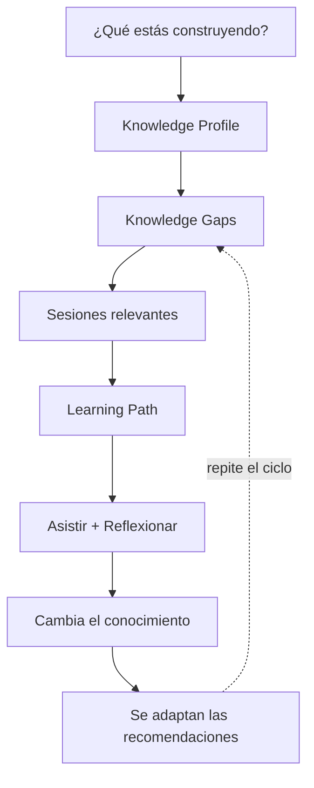
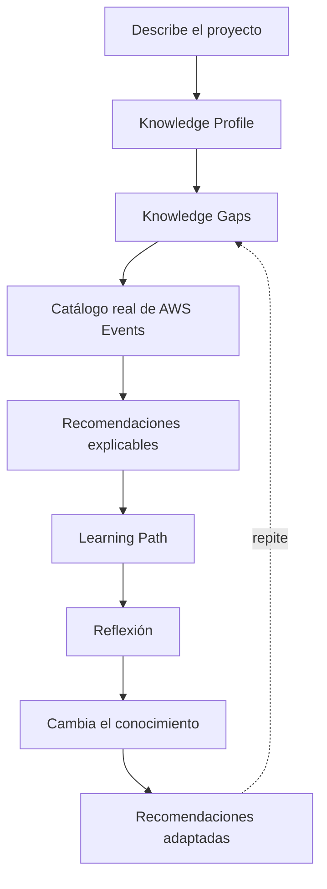

> Idioma del proyecto: **español**. Escribe este conocimiento en español. Mantén en inglés el código, los nombres de archivo, los comandos y las claves de configuración.

# Product Context

## Product vision

**re:Invent Pathfinder** es un companion basado en IA que transforma el catálogo de AWS re:Invent en una **ruta de aprendizaje personalizada y adaptativa**.

El producto parte de una pregunta distinta a los planners tradicionales:

> **¿Qué estás construyendo?**

A partir de la respuesta, Pathfinder identifica tecnologías, dominios, AWS services, retos de arquitectura y necesidades de conocimiento. Con esa información crea un `Knowledge Profile`, detecta `Knowledge Gaps`, consulta el catálogo real de AWS Events y recomienda sesiones que puedan cerrar esos gaps.

El producto no termina al generar una agenda inicial. Después de asistir a una sesión, el usuario puede registrar qué aprendió, qué sigue sin tener claro y qué tan útil fue la sesión. Pathfinder actualiza el perfil de conocimiento y adapta las siguientes recomendaciones.

La visión puede resumirse así:

Pathfinder no busca reemplazar el catálogo oficial de re:Invent. Busca agregar la capa de inteligencia que conecta **el contexto real del usuario con el conocimiento disponible en el evento**.

## User journeys

### Journey 1 — Crear el contexto de aprendizaje

1. El usuario inicia Pathfinder.
2. Describe qué está construyendo, el reto que enfrenta y/o qué desea aprender.
3. El sistema analiza el contexto.
4. Se genera un `Knowledge Profile`.
5. El sistema identifica y prioriza `Knowledge Gaps`.
6. El usuario puede revisar y ajustar lo inferido antes de continuar.

**Resultado:** existe una representación explícita de lo que el usuario necesita aprender.

### Journey 2 — Descubrir sesiones relevantes

1. Pathfinder obtiene el catálogo de AWS re:Invent desde AWS Events API.
2. El catálogo se normaliza y puede persistirse/cachearse según la estrategia técnica definida.
3. Se aplican filtros determinísticos usando metadata como topics, AWS services, roles, nivel y formato.
4. Los mejores candidatos pasan por análisis/ranking semántico.
5. Pathfinder muestra sesiones priorizadas.
6. Cada recomendación explica por qué es relevante, qué Knowledge Gap cubre, qué conocimiento puede aportar y qué trade-offs existen.

**Resultado:** el usuario recibe recomendaciones explicables, no una lista basada únicamente en keywords.

### Journey 3 — Construir el Learning Path

1. El usuario revisa las sesiones recomendadas.
2. Pathfinder construye una ruta priorizada.
3. El sistema considera conocimiento, horario y conflictos disponibles.
4. El usuario decide qué sesiones mantener, descartar o marcar como favoritas.

**Resultado:** existe un Learning Path inicial alineado con el proyecto del usuario.

### Journey 4 — Integrar la agenda de re:Invent

1. El usuario se autentica con AWS Builder ID mediante OAuth 2.0 + PKCE.
2. Pathfinder consulta la agenda personal.
3. Se muestran reservas, favoritos y personal time disponibles.
4. Pathfinder detecta conflictos con sesiones recomendadas.
5. Cuando la operación esté habilitada por AWS Events API, el usuario puede gestionar favoritos y reservas desde la experiencia.

**Resultado:** el Learning Path se conecta con la realidad operativa del evento.

### Journey 5 — Adaptar el aprendizaje durante el evento

1. El usuario asiste a una sesión.
2. Registra una reflexión corta: qué aprendió, qué sigue sin tener claro y qué tan útil fue.
3. Pathfinder interpreta la reflexión.
4. Actualiza el estado y prioridad de los Knowledge Gaps.
5. Recalcula las siguientes recomendaciones.

**Resultado:** el Learning Path cambia a medida que cambia el conocimiento del usuario.

### Journey 6 — Cerrar el ciclo de aprendizaje

1. Pathfinder compara el perfil inicial con el estado posterior al evento.
2. Identifica Knowledge Gaps cubiertos, parcialmente cubiertos y pendientes.
3. Puede generar un `Learning Report` y una ruta posterior a re:Invent.

**Resultado:** el aprendizaje del evento puede continuar después de la agenda física.

## Scope

### In scope — MVP core

#### Experience

- Captura de contexto del proyecto/reto.
- Visualización y edición del `Knowledge Profile`.
- Visualización de `Knowledge Gaps`.
- Presentación de recomendaciones explicables.
- Visualización del `Learning Path`.
- Captura de reflexiones post-sesión.

#### AWS Events

- OAuth 2.0 + PKCE con AWS Builder ID.
- Integración con AWS Events REST API.
- Obtención y paginación del catálogo.
- Normalización de sesiones.
- Lectura de agenda personal mediante `GetSchedule`.
- Favoritos.
- Detección de conflictos.
- Reservas/cancelaciones cuando estén disponibles y sean necesarias para la demo/MVP.

#### Knowledge

- Generación de `Knowledge Profile`.
- Identificación y priorización de `Knowledge Gaps`.
- Ingesta del conocimiento de sesiones.
- Amazon Bedrock Managed Knowledge Bases para recuperación semántica.
- Persistencia operacional en DynamoDB donde corresponda.

#### Recommendations

- `Candidate Filtering` determinístico.
- Scoring técnico previo al uso de IA.
- Ranking contextual con modelos de Amazon Bedrock.
- Explicación de recomendaciones.
- Construcción del Learning Path.
- Re-ranking después de cambios en el journey.

#### Agentic / AI

- Strands Agents SDK.
- Amazon Bedrock AgentCore Runtime.
- Amazon Bedrock para modelos.
- Un diseño de agentes reducido para el MVP; evitar un agente por cada función.
- Tools para análisis de contexto, Knowledge Gaps, recomendaciones, schedule y adaptación del journey.

#### Platform

- Backend serverless.
- API Gateway + Lambda.
- DynamoDB.
- Serverless Framework para la infraestructura tradicional.
- Observabilidad con CloudWatch y AgentCore Observability.
- CI/CD.
- Controles básicos de costo y seguridad.

### In scope — MVP extendido / condicionado

- `Personal Time`.
- Optimización básica por venue/horario.
- `Learning Report`.
- Demo/sitio público para Builder Center.
- Gestión completa de reservas si la API y el calendario del evento lo permiten durante el desarrollo.

### Out of scope — primera versión

- Aplicación móvil nativa.
- Red social entre asistentes.
- Chat generalista sobre cualquier tema de AWS.
- Reemplazar el planner o catálogo oficial de AWS.
- Recomendaciones para múltiples eventos AWS en la primera versión.
- Gestión empresarial/multi-tenant.
- Marketplace o sistema de sponsors.
- Sistema complejo de mapas o navegación indoor.
- Optimización avanzada de rutas físicas entre venues hasta validar que los datos disponibles lo permitan.
- Base vectorial autogestionada si `Amazon Bedrock Managed Knowledge Bases` cubre la necesidad.
- Arquitectura con EKS, ECS, EC2, RDS u OpenSearch sin una necesidad comprobada.
- Persistencia de tokens de AWS Events.
- Entrenar un modelo propio.

## Success criteria

### Criterios funcionales del MVP

El producto se considera funcional cuando un usuario puede completar de extremo a extremo este ciclo:

Además:

- El catálogo real puede consumirse de forma confiable y paginada.
- Los Knowledge Gaps generados pueden ser revisados por el usuario.
- Las recomendaciones indican claramente por qué son relevantes.
- La agenda personal puede leerse y reconciliarse con el Learning Path.
- Los conflictos de horario pueden identificarse.
- Las reflexiones modifican de forma observable el Knowledge Profile o las recomendaciones.
- Los tokens de AWS Events no se almacenan de forma insegura ni se envían al backend de Pathfinder.
- El backend de IA puede desplegarse y observarse en AWS.
- El proyecto puede ser ejecutado y contribuido por la comunidad con documentación suficiente.

### Señales de producto a observar

Durante el MVP se medirán, sin fijar todavía objetivos arbitrarios:

- tiempo hasta obtener el primer Learning Path;
- cantidad de recommendations generadas;
- recommendations aceptadas/favoritadas;
- Knowledge Gaps cubiertos o modificados;
- cantidad de journey recalculations;
- reflexiones completadas;
- errores de integración con AWS Events;
- latencia y costo de inferencia;
- feedback cualitativo sobre la relevancia de las recomendaciones.

La métrica más importante de validación es cualitativa:

> **¿El usuario considera que las sesiones recomendadas tienen sentido para lo que realmente está construyendo y aprendiendo?**
