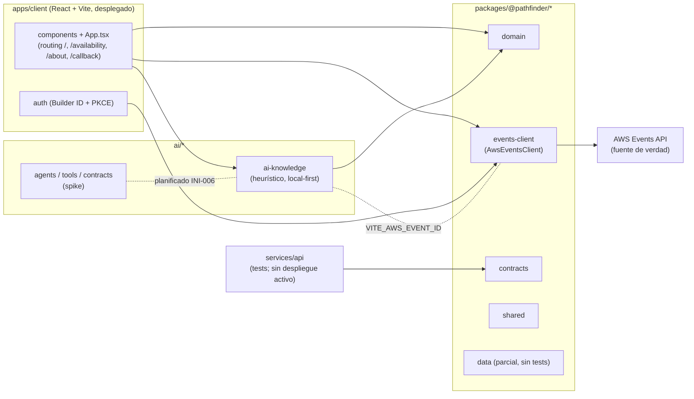
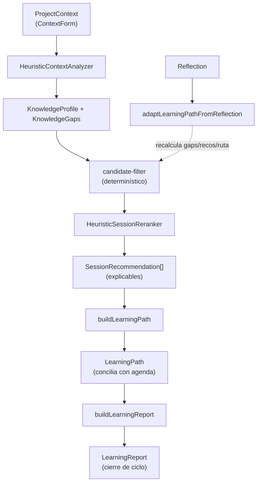
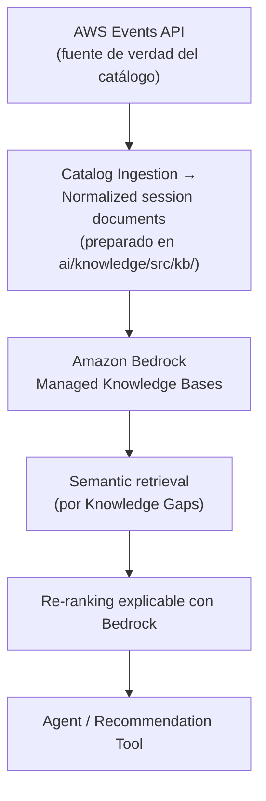

> Idioma del proyecto: **español**. Escribe este conocimiento en español. Mantén en inglés el código, los nombres de archivo, los comandos y las claves de configuración.

# Codebase Map

> **Estado (refinado por codebase-agent):** el proyecto ya NO es un esqueleto. Existe un monorepo
> `pnpm` con 11 paquetes TypeScript, project references de `tsc`, suite de tests Vitest por paquete
> y un cliente React desplegado en Netlify (`charlasreinvent.netlify.app`, publica `apps/client`).
> Esta sección describe la estructura **real existente**; lo que sigue siendo intención (bloque IA
> real sobre Bedrock, backend serverless desplegado) se marca explícitamente como planificado.

## Repository structure

Estructura real verificada en el repositorio:

```text
reinvent-pathfinder/
│
├── apps/
│   ├── client/                    # React + Vite + TypeScript (DESPLEGADO en Netlify)
│   │   └── src/
│   │       ├── App.tsx            # Routing local-first: /, /availability, /about, /callback
│   │       ├── components/        # LandingView, AvailabilityHeatmap, LearningPathView,
│   │       │                      # LearningReportView, ReflectionForm, KnowledgeProfileView,
│   │       │                      # KnowledgeGapsList, ContextForm, BuilderIdLogin
│   │       ├── auth/              # builder-id-transaction.ts + PKCE (Web Crypto API)
│   │       ├── fixtures/         # availability-heatmap.ts (demo sin login)
│   │       └── client.test.ts    # Tests SSR (renderToString)
│   └── site/                      # Placeholder DESCARTADO: la landing vive en apps/client (/about)
│
├── services/
│   └── api/                       # API serverless (implementada con tests; despliegue real pendiente)
│       └── src/
│
├── ai/
│   ├── knowledge/                 # Motor de conocimiento HEURÍSTICO / local-first (implementado)
│   │   └── src/
│   │       ├── context-analyzer.ts        # HeuristicContextAnalyzer
│   │       ├── recommendations/           # candidate-filter.ts, session-reranker.ts
│   │       │                              # (HeuristicSessionReranker)
│   │       ├── kb/                         # knowledge-base-client.ts, session-document-transformer.ts
│   │       └── index.ts                    # buildLearningPath, adaptLearningPathFromReflection,
│   │                                       # buildLearningReport
│   ├── agents/                    # journey-recommendation-agent.ts, knowledge-agent.ts (spike)
│   ├── tools/                     # Tools expuestas a los agentes
│   └── contracts/                 # Schemas de entradas/salidas agentic
│
├── packages/
│   ├── domain/                    # ProjectContext, KnowledgeProfile, KnowledgeGap,
│   │                              # SessionCandidate, SessionRecommendation, LearningPath,
│   │                              # Reflection, ScheduleConflict + lógica de proyección
│   ├── events-client/             # Adapter de AWS Events REST API (AwsEventsClient)
│   ├── data/                      # Repositories / contratos DynamoDB (sin tests aún)
│   ├── contracts/                 # DTOs y schemas compartidos
│   └── shared/                    # Utilidades compartidas
│
├── .github/workflows/ci.yml       # CI (GitHub Actions)
├── .kaddo/                        # Knowledge base generada por Kaddo (no editar a mano)
├── knowledge/                     # Knowledge base de Kaddo
├── netlify.toml                   # Deploy de apps/client
├── .node-version                  # Node objetivo (24)
├── eslint.config.mjs
├── vitest.config.ts
├── tsconfig.base.json             # Config base compartida
├── tsconfig.json                  # Project references del monorepo
├── pnpm-workspace.yaml
├── README.md
└── package.json
```

> No existen todavía `infra/`, `docs/` ni plantillas de `.github/ISSUE_TEMPLATE`; eran intención
> del bootstrap. Se crearán solo cuando aparezca necesidad real.

### Arquitectura de módulos (dependencias reales)



### Límites principales

#### `apps/client` — implementado y desplegado

Cliente local-first (React + Vite + TypeScript). Responsabilidades reales:

- Routing propio basado en estado (`route`/`navigate`/`popstate`) con rutas `/` (captura de
  contexto + diagnóstico), `/availability` (heat map de disponibilidad, demo sin login),
  `/about` (landing pública) y `/callback` (OAuth).
- Captura de contexto (`ContextForm`) y visualización de `KnowledgeProfile`/`KnowledgeGaps`.
- Construcción y visualización del `Learning Path` (`LearningPathView`) y reflexión post-sesión
  (`ReflectionForm`).
- `Learning Report` de cierre de ciclo (`LearningReportView`).
- Heat map de disponibilidad (`AvailabilityHeatmap`) en modo fixture o live.
- Login AWS Builder ID (`BuilderIdLogin`) con OAuth 2.0 + PKCE; tokens solo en memoria.
- Toda la lógica de recomendación/aprendizaje se ejecuta local-first contra `@pathfinder/ai-knowledge`.

Evidencia: `apps/client/src/App.tsx`, `apps/client/src/components/**`,
`apps/client/src/auth/builder-id-transaction.ts`, `apps/client/src/client.test.ts`.

#### `packages/events-client` — implementado

Adapter TypeScript de AWS Events REST API (`AwsEventsClient`). Encapsula:

- `ListSessions` con paginación por `nextToken` hasta agotarla.
- Normalización de sesiones (`normalizeAwsSession`) y de disponibilidad (`seatAvailability`,
  sin inferir capacidad; preserva niveles oficiales 100–500).
- `GetSchedule` (agenda personal), favoritos, reservas y cancelaciones.
- Normalización de errores (`AwsEventsError` y variantes 401/403/404/429) y manejo de throttling.
- Fixtures de desarrollo: `SAMPLE_RAW_SESSIONS`, `SAMPLE_USER_SCHEDULE`.

AWS Events API es la fuente de verdad del evento. Evidencia:
`packages/events-client/src/client/aws-events-client.ts`,
`packages/events-client/src/normalizer/**`, `packages/events-client/src/types/**`,
`packages/events-client/src/events-client.test.ts`.

#### `packages/domain` — implementado

Dominio independiente de AWS. Tipos y lógica de proyección/filtrado para disponibilidad,
Knowledge Gaps, recomendaciones y Learning Path. Evidencia: `packages/domain/src/types/**`,
`packages/domain/src/logic/**`, `packages/domain/src/domain.test.ts`.

#### `ai/knowledge` — implementado (HEURÍSTICO / local-first)

Motor de conocimiento y recomendaciones **sin IA externa**: analizador de contexto y reranker
heurísticos, construcción de Learning Path, adaptación por reflexión y Learning Report.

Flujo de datos real (local-first, sin red salvo integración live de AWS Events):



- `HeuristicContextAnalyzer` (`context-analyzer.ts`): deriva `KnowledgeProfile` y `KnowledgeGaps`.
- `candidate-filter.ts` + `HeuristicSessionReranker` (`recommendations/session-reranker.ts`):
  filtro determinístico + reordenamiento explicable.
- `index.ts`: `buildLearningPath`, `adaptLearningPathFromReflection`, `buildLearningReport`.
- `kb/`: cliente y transformador de documentos de sesión (preparación para KB semántica).

Evidencia: `ai/knowledge/src/**`, `ai/knowledge/src/context-analyzer.test.ts`,
`ai/knowledge/src/recommendations/recommendations.test.ts`,
`ai/knowledge/src/kb/knowledge-base.test.ts`.

> **Importante:** este bloque NO usa Amazon Bedrock, Strands ni AgentCore. La habilitación de IA
> real está planificada en la iniciativa **INI-006** y aún no está implementada.

Pipeline semántico **planificado** (INI-006, aún no implementado); hoy su equivalente lo cubre la
heurística anterior:



#### `ai/agents`, `ai/tools`, `ai/contracts` — spike / base

Contratos y esqueleto de agentes (`journey-recommendation-agent.ts`, `knowledge-agent.ts`) y tools,
provenientes del spike WI-010. Sin runtime Bedrock/AgentCore activo. Evidencia: `ai/agents/src/**`,
`ai/tools/src/**`, `ai/contracts/src/**`.

#### `services/api` — implementado (sin despliegue serverless activo)

Backend con tests, pensado para los endpoints de Pathfinder. El despliegue serverless real y la
integración Bedrock no están activos todavía. Evidencia: `services/api/src/**`.

#### `packages/contracts`, `packages/shared` — implementados

DTOs/schemas compartidos y utilidades. Evidencia: `packages/contracts/src/**`,
`packages/shared/src/**`.

#### `packages/data` — base, sin tests

Contratos/repositorios de persistencia DynamoDB. Aún sin suite de tests (el script usa
`--passWithNoTests`). Evidencia: `packages/data/src/**`.

## Entry points

- **Client:** `apps/client/src/main.tsx` monta `App.tsx` (routing local-first ya operativo).
- **Callback OAuth:** ruta `/callback` manejada dentro de `App.tsx` + `apps/client/src/auth/`.
- **Pathfinder API:** handlers bajo `services/api/src/` (implementados; contratos aún no estables).
- **Agentic runtime:** `ai/agents/src/` (spike; sin runtime desplegado).

## How to run

Experiencia de desarrollo real (local-first, sin AWS):

```bash
pnpm install
pnpm dev
```

El cliente arranca en el puerto de desarrollo de Vite. La demo pública (`/availability`) y la
landing (`/about`) funcionan **sin login** en modo fixture. El flujo autenticado con AWS Builder ID
resuelve su callback en `/callback`.

### Variables de entorno

- `VITE_AWS_EVENT_ID` — habilita el cliente live de AWS Events (`AwsEventsClient`) para un
  `eventId` concreto. Sin esta variable, el cliente opera solo en modo fixture local. Documentada
  en el `README.md`; se configura vía `.env` (ignorado por git) y hay un `.env.example` de muestra.
- `VITE_AUTH_REDIRECT_URI` — opcional; sobreescribe el `redirectUri` del callback de Builder ID.

### Verificación

```bash
tsc -b          # build de project references del monorepo
pnpm -r test    # suite Vitest de todos los paquetes
```

### Desarrollo con AWS / bloque agentic

Pendiente: el despliegue serverless (`services/api`) y el bloque IA real (INI-006, Bedrock/Strands/
AgentCore) se documentarán cuando se implementen. Hoy no se requieren credenciales AWS para
desarrollar la experiencia local-first.

## How to test

- **Framework:** Vitest por paquete. El cliente usa render SSR (`renderToString`) en
  `apps/client/src/client.test.ts`.
- **Cobertura actual (verificada por paquete):** `ai/knowledge` ~76, `packages/events-client` ~102,
  `packages/domain` ~28, `apps/client` 24, `packages/contracts` ~18, `services/api` ~18,
  `ai/tools` ~8, `ai/agents` ~4, `packages/shared` ~4. `packages/data` sin tests
  (`--passWithNoTests`).
- **Casos de resiliencia cubiertos en events-client:** paginación, `401`/`403`/`404`/`429`,
  campos opcionales ausentes, partial success en favoritos/reservas, reconciliación tras fallo.
- **CI:** `.github/workflows/ci.yml` (GitHub Actions) ejecuta la verificación en PRs.
- **Pendiente:** E2E con Playwright (propuesto, aún no implementado).

## Conventions

- **Lenguaje:** TypeScript estricto en todos los paquetes; project references de `tsc` (`tsc -b`).
- **Estilo del cliente:** componentes React presentacionales con estilos inline; vistas que reciben
  datos y callbacks por props (patrón de `LearningReportView`/`LandingView`), fáciles de testear por
  SSR sin stubs de red/auth.
- **Formato:** comillas dobles sin punto y coma; ESLint (`eslint.config.mjs`). Nota operativa: el
  reformateador reordena imports alfabéticamente; validar imports con `tsc -b` tras editar.
- **Nombres de paquetes:** namespace `@pathfinder/*` (p. ej. `@pathfinder/domain`,
  `@pathfinder/events-client`, `@pathfinder/ai-knowledge`, `@pathfinder/contracts`).
- **Local-first primero:** la lógica de valor corre en el cliente contra paquetes locales; AWS Events
  solo se consulta con `VITE_AWS_EVENT_ID` + sesión Builder ID.
- **Git:** ver la estrategia de Git del proyecto (no se repite aquí).

## Minimum criteria to start development

- Node según `.node-version` (24) y `pnpm`.
- `pnpm install` + `pnpm dev` levantan el cliente sin AWS.
- `tsc -b` y `pnpm -r test` en verde antes de considerar un cambio terminado.
- No se requieren credenciales AWS ni `serverless login` para la experiencia local-first.

## Open questions

Preguntas realmente abiertas (las resueltas durante la entrega ya no se listan):

- [open] **Despliegue de `services/api`.** Falta activar el despliegue serverless real y definir su
  pipeline; hoy existe código y tests pero no despliegue.
- [open] **Bloque IA real (INI-006).** Topología final de agentes, IaC (`agentcore deploy` vs. otro),
  modelo Bedrock y límite Lambda ↔ AgentCore. Pertenece a INI-006, aún no implementado.
- [open] **Persistencia DynamoDB.** `packages/data` tiene base pero sin modelo single-table definido
  ni tests; definir keys y retención cuando se active persistencia central.
- [open] **E2E.** Introducir Playwright para los journeys críticos.
